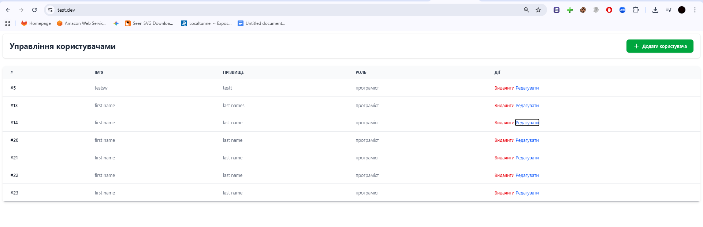

# Test Task - Pavel Mister
A simple project built using pure PHP and MySQL (PDO).

# Requirements
 - PHP: 8.3 or higher
 - MySQL: 5.6 or higher
 - PDO Extension enabled

# Installation 
1. Clone repository. `git clone https://github.com/PavelMister/testdev.git`
2. Configure database using .env.example (copy example file to .env and make you're changes).
`cp .env.example .env`
3. Import db (using dump.sql).
`mysql -u your_user -p your_db_name < dump.sql`
4. Web Server Configuration: Configure your web server (Apache/Nginx) to point to the /public directory as the 
   document root.
   - Note: An .htaccess file is already provided in the public/ directory for Apache routing.

# Project Overview
This project is divided into two main parts:
User Management: Accessible on the main page — https://test.dev/
Example:

Goods Management: Accessible at — https://test.dev/goods

Note: Please replace test.dev with your actual local domain (e.g., localhost or testdev.local).
